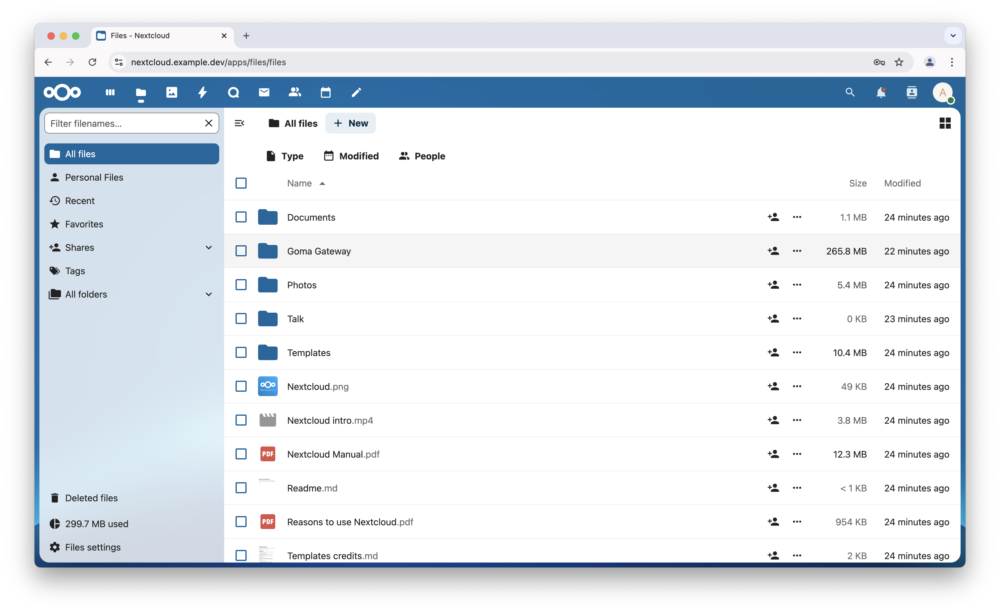
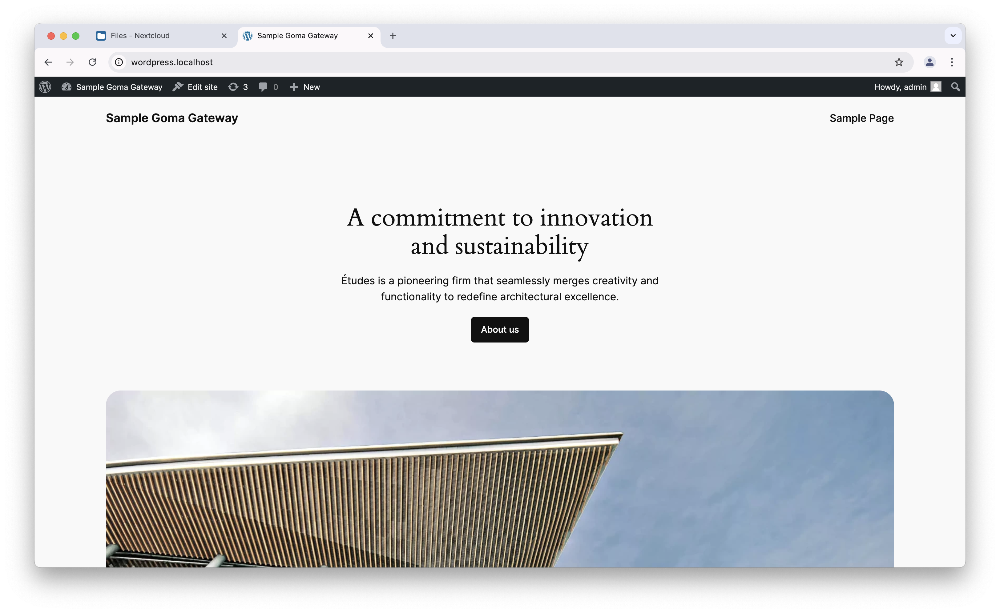

# Goma Gateway 
A sample Docker deployment of Goma Gateway as a reverse proxy.
## Services

- Nexcloud
- Wordpress

## Requirements
- Docker
- mkcert - optional
## SSL
You can generate ssl certificate using [mkcert](https://github.com/FiloSottile/mkcert)

uncomment `sslCertFile` and `sslKeyFile` in  config/goma.yml.

```sh
mkcert -key-file config/key.pem -cert-file config/cert.pem "*.example.dev"
```

## Start

Create `web` network

```sh
docker network create  web
```
## Run

```sh
docker compose up -d
```

## Domains

### Nextcloud
    - nextcloud.example.dev
    - nextcloud.localhost

### Wordpress
    - nextcloud.example.dev
    - nextcloud.localhost

## Hosts
Update hosts file

The location of the hosts file will differ by operating system. The typical locations are noted below.

- Windows 10 – “C:\Windows\System32\drivers\etc\hosts”
- Linux – “/etc/hosts”
- Mac OS X – “/private/etc/hosts” or “/etc/hosts”

```
127.0.0.1   nextcloud.example.dev
127.0.0.1   wordpress.example.dev
```

## Access

 - Nexcloud:
    - [nextcloud.example.dev](http://nextcloud.example.dev)
    - [nextcloud.localhost](http://nextcloud.localhost)
 - Wordpress:
    - [wordpress.example.dev](http://wordpress.example.dev)
    - [wordpress.localhost](http://wordpress.localhost)

----
### Screnshot


